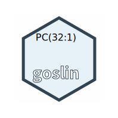

# goslin

Goslin is the **G**rammar **o**n **s**uccinct **li**pid **n**omenclature.

Goslin defines multiple grammers compatible with ANTLRv4 for different sources of shorthand lipid nomenclature. This allows to generate parsers based on the defined grammars, which provide immediate feedback whether a processed lipid shorthand notation string is compliant with a particular grammar, or not.

[Overview of Goslin and Tutorials](docs/README.adoc)

## References
* [D. Kopczynski et al., Biorxiv, April 20th, 2020](https://doi.org/10.1101/2020.04.17.046656)

## Related Projects

- [This project](http://github.com/lifs-tools/goslin)
- [C++ implementation](https://github.com/lifs-tools/cppgoslin)
- [Java implementation](https://github.com/lifs-tools/jgoslin)
- [Python implementation](https://github.com/lifs-tools/pygoslin)
- [R implementation](https://github.com/lifs-tools/rgoslin)
- [Webapplication and REST API](https://github.com/lifs-tools/goslin-webapp)

## Test data

1. lipidmaps-names-Feb-10-2020.tsv - generated from [LipidMAPS LMSDB](https://www.lipidmaps.org/) export on Feb. 10th, 2020. Filtered all entries without an abbreviation.
2. swisslipids-names-Feb-10-2020.tsv - generated from [Swiss Lipids](https://www.swisslipids.org) (lipids table) export on Feb. 10th ,2020.

Short samples of lipid names used for testing of the implementations are available from the [testfiles directory](testfiles/).

## License

The Goslin grammars are licensed under the terms of the MIT license (see [LICENSE](LICENSE)).
