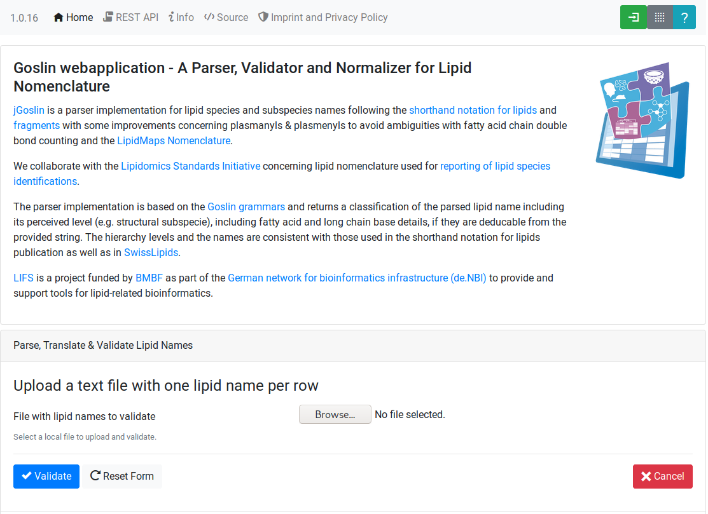
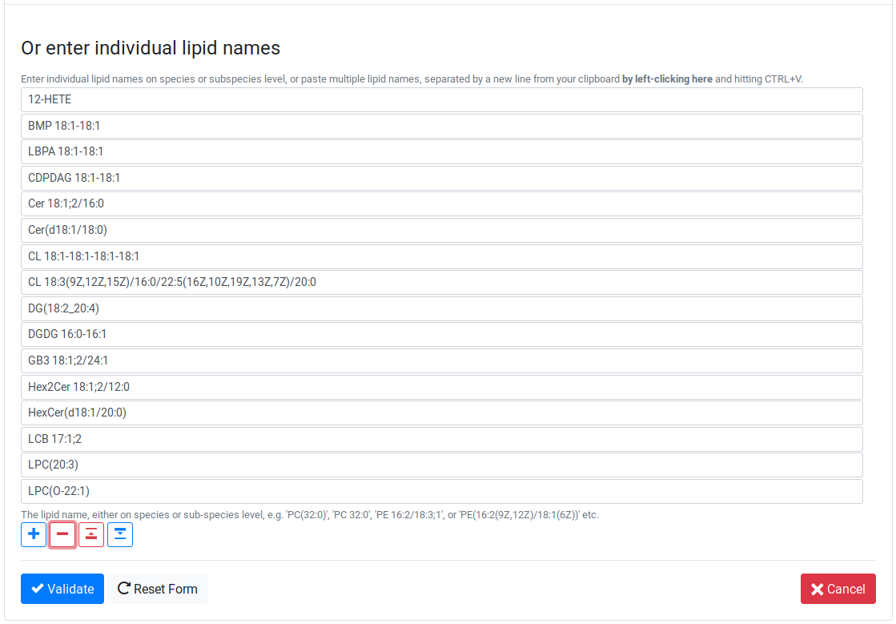
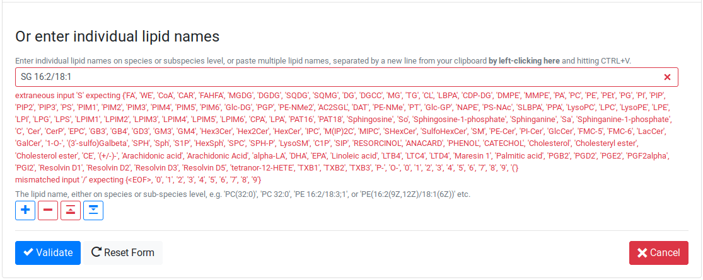
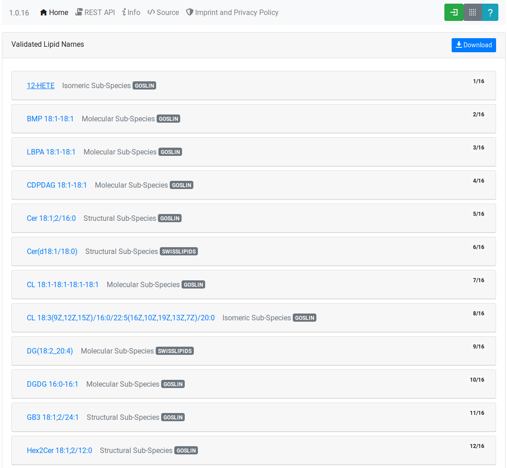
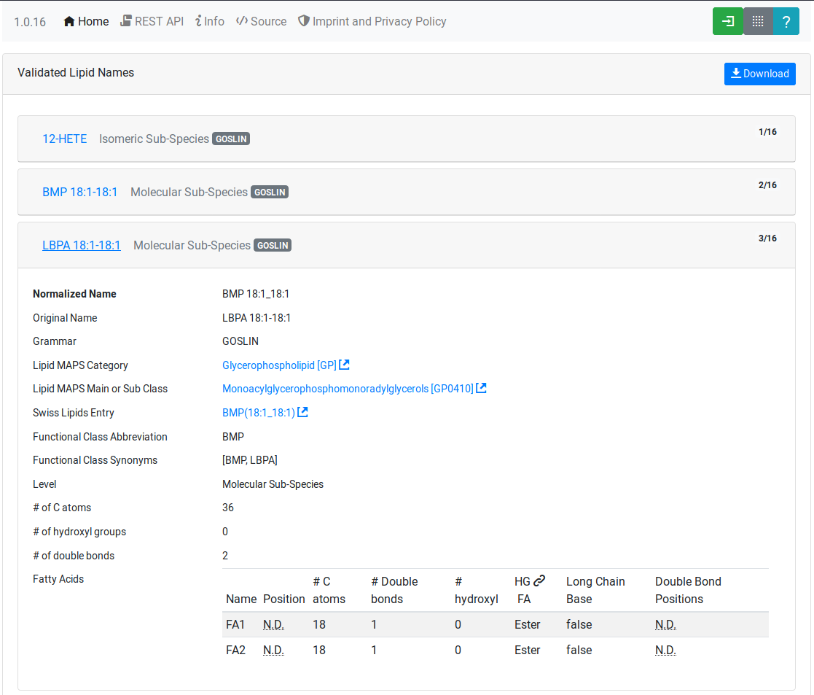
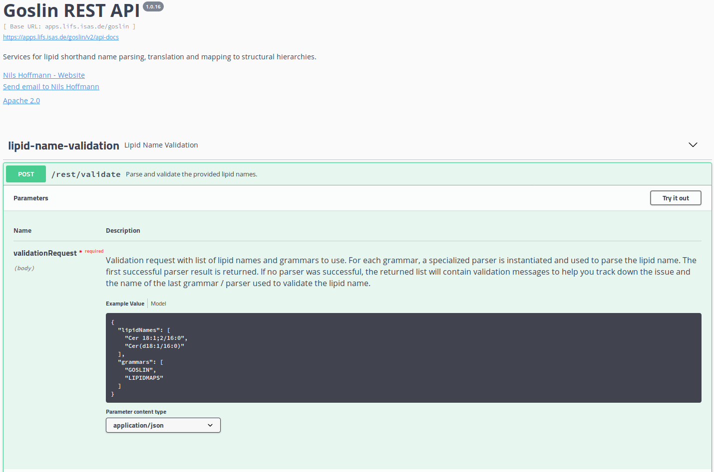
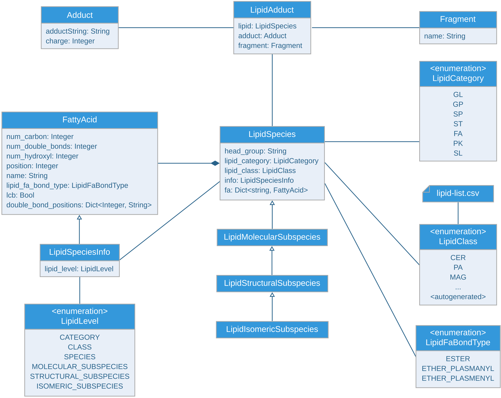

= Goslin Implementation and User Guide
Dominik Kopczynski; Nils Hoffmann; Bing Peng; Robert Ahrends

:toc:

[[sec:introduction]]
== Introduction
This document gives an overview for users and developers who want to use the Goslin Webapplication, REST API, or any of the implementations in C++, R, Python or Java.

[[sec:webServiceUsers]]
== Web Application and REST API

Interactive Usage
~~~~~~~~~~~~~~~~~

The interactive goslin web application is available
at https://apps.lifs.isas.de/goslin. It provides two forms to i) upload
a file containing one lipid name per line (see Supplementary
Figure <<fig:goslin-webapp-form-01>>), or ii)
upload a list of lipid names, defined by the user in an interactive form
(see Supplementary
Figure <<fig:goslin-webapp-form-02>>). The
latter form also allows pasting lists of lipid names directly from the
clipboard with `CTRL+V`. Both forms provide feedback for issues
concerning every processed lipid, such as invalid names or typos (see
Supplementary
Figure #fig:goslin-webapp-rest-02a[[fig:goslin-webapp-rest-02a]]), to
allow the user to cross-check their data before proceeding.

[#fig:goslin-webapp-form-01]
.Goslin web application submission form for text files with one lipid name per row.

[#fig:goslin-webapp-form-02]
.Goslin web application submission form for user-defined lipid names.

[#fig:goslin-webapp-form-02a]
.Goslin web application submission form for user-defined lipid names provides feedback for unknown or unsupported names and parts thereof.

[#fig:goslin-webapp-form-03]
.Parsing results are displayed as ’cards’ for every lipid name. Clicking on a card opens it and shows details of the according lipid.

After successful validation, the validated lipids are returned in
overview cards (see Supplementary
Figure <<fig:goslin-webapp-result-03>>),
detailing their LipidMAPS classification, cross-links to SwissLipids
and/or LipidMAPS or HMDB. Additionally, the cards show summary
information about the number of carbon atoms, double bonds,
hydroxylations and detailed information, such as double bond position,
long-chain-base status, and the bond type of the fatty acyl to the head
group for each fatty acyl, if available (see Supplementary
Figure <<fig:goslin-webapp-rest-04>>) .

[#fig:goslin-webapp-rest-04]
.Each result card displays summary and detail information about a lipid. Depending on the lipid level, this can include information about each individual fatty acyl. Cross-links to SwissLipids and LipidMAPS are shown where a normalized lipid name could be matched unambiguously against the normalized names of SwissLipids and / or LipidMAPS lipids.

The source code for the web application and instructions to build it as
a Docker container are available at
https://github.com/lifs-tools/goslin-webapp under the terms of the open
source Apache license version 2.

Programmatic access via the REST API
~~~~~~~~~~~~~~~~~~~~~~~~~~~~~~~~~~~~

An interactive documentation for the rest api of the goslin web
application is available at
https://apps.lifs.isas.de/goslin/swagger-ui.html (see Supplementary
Figure <<fig:goslin-webapp-rest-05>>). To
illustrate its usage, we will briefly show a small example how a user
can access the rest api with a standard http client.

[#fig:goslin-webapp-rest-05]
.The goslin web application provides an interactive documentation for its rest api to simplify programmatic access.

The Structure for the request consists of a json object \{} enclosing
two lists, with the names `lipidNames` and `grammars`. Acceptable values
for `grammars` are: `LIPIDMAPS`, `GOSLIN`, `GOSLIN_FRAGMENTS`,
`SWISSLIPIDS`, and `HMDB`. A complete list is available from the
interactive rest api documentation’s `Models` section under
`ValidationRequest`. Both fields in the `ValidationRequest` accept
comma-separated entries, enclosed in double quotes:

....
  {
      "lipidNames": [
        "Cer(d18:1/16:1(6Z))"
      ],
      "grammars": [
        "LIPIDMAPS"
      ]
  }
  
....

Sending the http POST request with `curl` as an http client looks as
follows:

....
  curl -X POST "https://apps.lifs.isas.de/goslin/rest/validate" -H  "accept: */*" -H  "Content-Type: application/json" -d "{  \"lipidNames\": [    \"Cer(d18:1/16:1(6Z))\"  ],  \"grammars\": [    \"LIPIDMAPS\"  ]}"
  
....

The rest api will return the following result for the request, with a
http response code of 200 (OK). This result returns a map of properties
for each lipid name that was parsed. If at least one name is not
parseable, the rest api will return a response code of 400 (Client
error), together with the same results reponse object. In that case, the
`failedToParse` field in the response will contain the number of lipid
names that could not be parsed. For those results where no grammar was
applicable, the `grammar` field will contain the string
`NOT_PARSEABLE`.¸In other cases, that field will contain the last
grammar used to parse the lipid name and the `messages` field will
contain a list of validation messages that help to narrow down the
offending bits in the lipid name.

[source,json]
----
{
  "results": [
    {
      "lipidName": "Cer(d18:1/16:1(6Z))",
      "grammar": "LIPIDMAPS",
      "messages": [],
      "lipidAdduct": {
        "lipid": {
          "lipidCategory": "SP",
          "lipidClass": "CER",
          "headGroup": "Cer",
          "info": {
            "type": "STRUCTURAL",
            "name": "Cer",
            "position": -1,
            "lipidFaBondType": "ESTER",
            "lcb": false,
            "modifications": [],
            "doubleBondPositions": {},
            "level": "STRUCTURAL_SUBSPECIES",
            "ncarbon": 34,
            "nhydroxy": 2,
            "ndoubleBonds": 2
          },
----

The response part also reports the normalized name (`goslinName`), as
well as classification information using the LipidMAPS category and
class associated to the parsed lipid.

[source,json]
----
      },
      "goslinName": "Cer 18:1;2/16:1(6Z)",
      "lipidMapsCategory": "SP",
      "lipidMapsClass": "SP0203",
----

The response also reports information on the fatty acyls detected in the
lipid name. In this case, a lcb (in the ceramide) has been detected. The
name given here as an example was classified on structural subspecies
level, since the lcb contains one double bond, but without positional
E/Z information. The fatty acyl FA1 at the sn2 position does report E/Z
information for its double bond, thus FA1 is an isomeric fatty acyl.
Overall, the lipid can thus be classified as a structural subspecies.

[source,json]
----
      "fattyAcids": {
        "LCB": {
          "type": "STRUCTURAL",
          "name": "LCB",
          "position": 1,
          "lipidFaBondType": "ESTER",
          "lcb": true,
          "modifications": [],
          "doubleBondPositions": {},
          "ncarbon": 18,
          "nhydroxy": 2,
          "ndoubleBonds": 1
        },
        "FA1": {
          "type": "ISOMERIC",
          "name": "FA1",
          "position": 2,
          "lipidFaBondType": "ESTER",
          "lcb": false,
          "modifications": [],
          "doubleBondPositions": {
            "6": "Z"
          },
          "ncarbon": 16,
          "nhydroxy": 0,
          "ndoubleBonds": 1
        }
      }
----

Finally, the response reports the total number lipid names received, the
total number parsed and the total number of parsing failures.

[source,json]
----
  ],
  "totalReceived": 1,
  "totalParsed": 1,
  "failedToParse": 0
}
----

C++ Implementation
------------------

This is the documentation for the goslin reference implementation for
C++. Please be aware, that the documentation is dedicated to developers
of tools for computational lipidomics who want to use cppgoslin within
their project. If you are interested to run goslin as a user, please
read  <<sec:webServiceUsers>>. The cppgoslin
implementation has been developed with the following objectives:

1.  To ease the handling with lipid names for developers working on mass
spectro-metry-based lipidomics tools.
2.  To offer a tool that unifies all existing dialects of lipid names.

It is an open-source package under the MIT License available via
github footnote:[https://github.com/lifs-tools/cppgoslin]. For a detailed
structure of the implementation, read Supplementary
Section <<sec:goslinObjectModel>>.

Prerequisites
~~~~~~~~~~~~~

The cppgoslin library needs a GNU g++ compiler version with support for
the C++ 11 standard. It comes with simple makefiles for easy compilation
and installation. You need the following packages:

....
$ g++ (compiler)
$ make
  
....

To install the library globally on your system, simply type:

....
$ [sudo] make install
  
....

Be sure that you have root permissions. Here, the library and headers
are installed into the /usr directory. If you want to change that
location, you have to edit the first line within the _makefile_.

Testing cppgoslin
~~~~~~~~~~~~~~~~~

We set up more than 150 000 single unit and integration tests, to ensure
that cppgoslin is parsing correctly. To run the tests, please type:

....
$ make test
$ make runtests
....

If a test should fail, please contact the
developers.

Using cppgoslin
~~~~~~~~~~~~~~~

The two major functions within cppgoslin are the parsing and printing of
lipid names. A minimalistic example will demonstrate both functions the
easiest way. In the examples folder, you will find the
_lipid_name_parser.cpp_ file. Compile it by typing:

....
$ cd examples
$ make
$ ./lipid_name_parser
....

Here is the minimalistic C++ code:

[source,c++]
----
#include "cppgoslin/cppgoslin.h"
#include <iostream>
int main(){
    LipidParser parser;
    try {
        LipidAdduct* lipid = parser.parse("PA(12:0_14:0)");
        cout << lipid->get_lipid_string() << endl;
        delete lipid;
    }
    catch(LipidException& e){
        // handle the exception
        cout << e.what() << endl;
    }
    return 0;
}
----

To handle unexpected behavior, the parsing command should always be
placed within a try/catch block and the `LipidAdduct` pointer should be
deleted after usage to avoid memory leaks. Be aware when changing the
installation directory, you also have to change the library directory
within the examples _makefile_.

To retrieve a parsed lipid name on a higher hierarchy of lipid level,
simply define the level when requesting the lipid name:

[source,c++]
----
#include "cppgoslin/cppgoslin.h"
#include <iostream>
int main(){
    LipidParser parser;
    try {
        // providing a lipid name on isomeric subspecies level
        LipidAdduct* lipid = parser.parse("PA(12:1(5Z)/14:0)");
        cout << lipid->get_lipid_string(ISOMERIC_SUBSPECIES) << endl;
        cout << lipid->get_lipid_string(STRUCTURAL_SUBSPECIES) << endl;
        cout << lipid->get_lipid_string(MOLECULAR_SUBSPECIES) << endl;
        cout << lipid->get_lipid_string(SPECIES) << endl;
        cout << lipid->get_lipid_string(CLASS) << endl;
        cout << lipid->get_lipid_string(CATEGORY) << endl;
        delete lipid;
    }
    catch(LipidException& e){
        // handle the exception
        cout << e.what() << endl;
    }
    return 0;
}
----

Requesting a lipid name on a lower level than the provided will throw an
exception. This functionality especially enables an easy way for
computing data for histograms on lipid class or category level. +
  +
To increase the parsing performance, one can pick a parser for only one
specific grammar:

[source,c++]
----
GoslinParser goslin_parser;
GoslinFragmentParser goslin_fragment_parser;
LipidMapsParser lipid_maps_parser;
SwissLipidsParser swiss_lipids_parser;
HmdbParser hmdb_parser;
----

Python Implementation
---------------------

This is the documentation for the goslin reference implementation for
Python 3. Please be aware, that the documentation is dedicated to
developers of tools for computational lipidomics who want to insert
pygoslin into their project. If you are interested to run goslin as a
user, please read Section <<sec:webServiceUsers>>. The pygoslin
implementation has been developed with the following objectives:

1.  To ease the handling with lipid names for developers working on mass
spectrometrybased lipidomics tools.
2.  To offer a tool that unifies all existing dialects of lipid names.

It is an open-source package under the MIT License available via
github footnote:[https://github.com/lifs-tools/pygoslin]. For a detailed
structure of the implementation, read Supplementary
Section <<sec:goslinObjectModel>>.

Prerequisites
~~~~~~~~~~~~~

The pygoslin package uses Python’s package management system _pip_ to
create an isolated and defined build environment. You need Python >=3.5
and the following packages to build the pygoslin package:

....
python3-pip
cython (module for Python 3)
make (optional)
....

  +
To install the package globally in your Python distribution, simply
type:

....
$ [sudo] make install
....

or

....
$ [sudo] python setup.py install
....

Be sure that you have root permissions.

Testing pygoslin
~~~~~~~~~~~~~~~~

We set up more than 150 000 single unit and integration tests, to ensure
that pygoslin is parsing correctly. To run the tests, please type:

....
$ make test
....

or

....
$ python3 -m unittest pygoslin.tests.FattyAcidTest
$ python3 -m unittest pygoslin.tests.ParserTest
$ python3 -m unittest pygoslin.tests.SwissLipidsTest
$ python3 -m unittest pygoslin.tests.GoslinTest
$ python3 -m unittest pygoslin.tests.LipidMapsTest
$ python3 -m unittest pygoslin.tests.HmdbTest
....

Using pygoslin
~~~~~~~~~~~~~~

The two major functions within pygoslin are the parsing and printing of
lipid names. You have several options, to access these functions. This
example will demonstrate both functions the easiest way. Open a Python
shell and type in:

[source,python]
----
from pygoslin.parser.Parser import LipidParser

lipid_parser = LipidParser()  # setup the parser
lipid_name = "PE 16:1-12:0"

try:
    lipid = lipid_parser.parse(lipid_name)  # start parsing
    print(lipid.get_lipid_string())
except Exception as e:
    print(e)         # handle the exception
----

For all unexpected states, an exception is being raised. Be aware, that
this method uses all available grammars in turn until a lipid name can
be parsed successfully by a parser. Currently, five grammars are
available, namely: Goslin, GoslinFragment, LipidMaps, SwissLipids, HMDB.
To use a specific grammar / parser, you can use the following code:

[source,python]
----
# using solely the Goslin parser
from pygoslin.parser.Parser import GoslinParser
goslin_parser = GoslinParser()

lipid_name = "Cer 18:1;2/12:0"
try:
    lipid = goslin_parser.parse(lipid_name)
    print(lipid.get_lipid_string())
except Exception as e:
    print(e)
----

  +

[source,python]
----
# using solely the Goslin Fragment parser
from pygoslin.parser.Parser import GoslinFragmentParser
goslin_fragment_parser = GoslinFragmentParser()

lipid_name = "Cer 18:1;2/12:0"
try:
    lipid = goslin_fragment_parser.parse(lipid_name)
    print(lipid.get_lipid_string())
except Exception as e:
    print(e)
----

  +

[source,python]
----
# using solely the LipidMaps parser
from pygoslin.parser.Parser import LipidMapsParser
lipid_maps_parser = LipidMapsParser()

lipid_name = "Cer(d18:1/12:0)"
try:
    lipid = lipid_maps_parser.parse(lipid_name)
    print(lipid.get_lipid_string())
except Exception as e:
    print(e)
----

  +

[source,python]
----
# using solely the SwissLipids parser
from pygoslin.parser.Parser import SwissLipidsParser
swiss_lipids_parser = SwissLipidsParser()

lipid_name = "Cer(d18:1/12:0)"
try:
    lipid = swiss_lipids_parser.parse(lipid_name)
    print(lipid.get_lipid_string())
except Exception as e:
    print(e)
----

  +

[source,python]
----
# using solely the HMDB parser
from pygoslin.parser.Parser import HmdbParser
hmdb_parser = HmdbParser()

lipid_name = "Cer(d18:1/12:0)"
try:
    lipid = hmdb_parser.parse(lipid_name)
    print(lipid.get_lipid_string())
except Exception as e:
    print(e)
----

To be as generic as possible, no treatment of validation of the fragment
is conducted within the GoslinFragmentParser. +
  +
To retrieve a parsed lipid name on a higher hierarchy of lipid level,
simply define the level when requesting the lipid name:

[source,python]
----
# report on different lipid hierarchies
from pygoslin.parser.Parser import *
from pygoslin.domain.LipidLevel import LipidLevel

parser = LipidParser()
# providing a lipid name on isomeric subspecies level
lipid_name = "PA 18:1(5Z)/12:0"

try:
    lipid = parser.parse(lipid_name)
    print(lipid.get_lipid_string(LipidLevel.ISOMERIC_SUBSPECIES))
    print(lipid.get_lipid_string(LipidLevel.STRUCTURAL_SUBSPECIES))
    print(lipid.get_lipid_string(LipidLevel.MOLECULAR_SUBSPECIES))
    print(lipid.get_lipid_string(LipidLevel.SPECIES))
    print(lipid.get_lipid_string(LipidLevel.CLASS))
    print(lipid.get_lipid_string(LipidLevel.CATEGORY))
except Exception as e:
    print(e)
----

This functionality especially enables an easy way for computing data for
histograms on lipid class or category level. Requesting a lipid name on
a lower level than the provided will raise an exception.

R Implementation
----------------

This project is a parser, validator and normalizer implementation for
shorthand lipid nomenclatures, using the Grammar of Succinct Lipid
Nomenclatures project for the R language ([https://www.r-project.org/]).

Goslin defines multiple grammars compatible with ANTLRv4 for different
sources of shorthand lipid nomenclature. This allows to generate parsers
based on the defined grammars, which provide immediate feedback whether
a processed lipid shorthand notation string is compliant with a
particular grammar, or not.

rgoslin uses the goslin grammars and the cppgoslin parser to support the
following general tasks:

1.  Facilitate the parsing of shorthand lipid names dialects.
2.  Provide a structural representation of the shorthand lipid after
parsing.
3.  Use the structural representation to generate normalized names.

rgoslin is an open-source package available via
github footnote:[https://github.com/lifs-tools/rgoslin].

Prerequisites
~~~~~~~~~~~~~

This project uses the R programming language. To be able to use it,
please install R: [https://cloud.r-project.org/] following the
instructions for your particular operating system. rgoslin is based on
native C++ code (via cppgoslin). It therefore requires additional tools
on your system to compile and install it. Please see the Rcpp
FAQ: [https://cran.r-project.org/web/packages/Rcpp/vignettes/Rcpp-FAQ.pdf],
question 1.3 for installation details for your specific operating
system.

Install the ‘devtools‘ package with the following command.

[source,r]
----
if(!require(devtools)) { install.packages("devtools") }
----

Run

[source,r]
----
install_github("lifs-tools/rgoslin")
----

to install from the github repository.

This will install the latest, potentially unstable development version
of the package with all required dependencies into your local R
installation.

If you want to use a proper release version, referenced by a Git tag
(here: v1.0.0) install the package as follows:

[source,r]
----
install_github("lifs-tools/rgoslin", ref="v1.0.0")
----

If you have cloned the code locally, use devtools as follows. Make sure
you set the working directory to where the API code is located. Then
execute

[source,r]
----
library(devtools)
install(".")
----

Testing rgoslin
~~~~~~~~~~~~~~~

rgoslin uses the testthat R package to provide unit tests for the lipid
name parsing methods. The tests are located in the `tests` folder. To
run the tests, execute

[source,r]
----
library(devtools)
test()
----

Using rgoslin
~~~~~~~~~~~~~

To load the package, start an R session and type

[source,r]
----
library(rgoslin)
----

Type the following to see the package vignette / tutorial:

[source,r]
----
vignette('introduction', package = 'rgoslin')
----

In order to use the provided translation functions of rgoslin, you first
need to load the library.

[source,r]
----
library(rgoslin)
----

To check, whether a given lipid name can be parsed by any of the parsers
supplied by cppgoslin, you can use the `isValidLipidName` method. It
will return `TRUE` if the given name can be parsed by any of the
available parsers and `FALSE` if the name was not parseable.

[source,r]
----
isValidLipidName("PC 32:1")
----

Using `parseLipidName` with a lipid name returns a named vector of
properties of the parsed lipid name.

[source,r]
----
pc32vector <- parseLipidName("PC 32:1")
pc32df <- as.data.frame(t(pc32vector))
----

If you want to set the grammar to parse against manually, this is also
possible:

[source,r]
----
originalName <- "TG(16:1(5E)/18:0/20:2(3Z,6Z))"
tagVec <- rgoslin::parseLipidNameWithGrammar(originalName, "LipidMaps")
tagDf <- as.data.frame(t(tagVec))
----

Currently, the following grammars are available: LipidMaps, SwissLipids,
Goslin, GoslinFragments, HMDB.

If you want to parse multiple lipid names, use the `parseLipidNames`
method with a vector of lipid names. This returns a data frame of
properties of the parsed lipid names with one row per lipid.

[source,r]
----
multipleLipidNames <- parseLipidNames(c("PC 32:1","LPC 34:1","TG(18:1_18:0_16:1)"))
----

Finally, if you want to parse multiple lipid names and want to use one
particular grammar:

[source,r]
----
originalNames <- c("PC 32:1","LPC 34:1","TAG 18:1_18:0_16:1")
multipleLipidNamesWithGrammar <- parseLipidNamesWithGrammar(originalNames, "Goslin")
----

Java Implementation
-------------------

This project is a parser, validator and normalizer implementation for
shorthand lipid nomenclatures, based on goslin for the Java programming
language: [https://go.java/].

goslin defines multiple grammars compatible with ANTLRv4 for different
sources of shorthand lipid nomenclature. This allows to generate parsers
based on the defined grammars, which provide immediate feedback whether
a processed lipid shorthand notation string is compliant with a
particular grammar, or not.

Here, jgoslin uses the goslin grammars and the generated parsers to
support the following general tasks:

1.  Facilitate the parsing of shorthand lipid names dialects.
2.  Provide a structural representation of the shorthand lipid after
parsing.
3.  Use the structural representation to generate normalized names.

Furthermore, jgoslin is an open-source package available via
github footnote:[https://github.com/lifs-tools/jgoslin].

Prerequisites
~~~~~~~~~~~~~

This project is based on Java 11. To use it, you need a jre installed on
your system. If you want to use the library in your own Java projects,
you need a jdk installed on your system. Please consult
[https://adoptopenjdk.net/installation.html] for installation options and
instructions for your operating system.

Installation instructions

Building the project and generating client code from the command-line

In order to build the client code and run the unit tests, execute the
following command from a terminal:

....
./mvnw install
....

or on Windows:

....
mvnw.bat install
....

This compiles and tests the Java library.

Testing jgoslin
~~~~~~~~~~~~~~~

Here, jgoslin comes with a comprehensive collection of unit (JUnit 5),
integration (JUnit 5) and acceptance (Cucumber) tests. You can run all
of them as follows:

....
./mvnw verify
....

Using the command-line interface
~~~~~~~~~~~~~~~~~~~~~~~~~~~~~~~~

The `cli` sub-project provides a cli for parsing of lipid names either
from the command line or from a file with one lipid name per line.

After building the project as mentioned above with `./mvnw install`, the
`cli/target` folder will contain the `jgoslin-cli-<VERSION>-bin.zip`
file. Alternatively, you can download the latest cli zip file from
Bintray: https://bintray.com/lifs/maven/jgoslin-cli[Search for latest
jgoslin-cli-<VERSION>-bin.zip artefact] and click to download.

In order to run the validator, unzip that file, change into the unzipped
folder and run

....
java -jar jgoslin-cli-<VERSION>.jar
....

to see the available options.

To parse a single lipid name from the command line using all available
parsers, run

....
java -jar jgoslin-cli-<VERSION>.jar -n "Cer(d18:1/20:2)"
....

The output will tell you what is done and will echo a table of the
results to the terminal:

[source,bash]
----
Parsing lipid identifier: Cer(d18:1/20:2)
Parsing lipid identifier: Cer(d18:1/20:2)
Parsing lipid maps identifier: Cer(d18:1/20:2)
Parsing swiss lipids identifier: Cer(d18:1/20:2)
Parsing HMDB lipids identifier: Cer(d18:1/20:2)
Echoing output to stdout.
Normalized Name Original Name   Grammar Message Lipid Maps Category Lipid Maps Main Class   Functional Class Abbr   Functional Class Synonyms   Level   Total #C    Total #OH   Total #DB   LCB SN Position LCB #C  LCB #OH LCB #DB LCB Bond Type   FA1 SN Position FA1 #C  FA1 #OH FA1 #DB FA1 Bond Type
Cer(d18:1/20:2) GOSLIN  no viable alternative at input 'Cer('                                                                       
Cer(d18:1/20:2) GOSLIN_FRAGMENTS    no viable alternative at input 'Cer('                                                                   
Cer 18:1;2/20:2 Cer(d18:1/20:2) LIPIDMAPS       Sphingolipid [SP]   N-acyl-4-hydroxysphinganines (phytoceramides) [SP0203]  [Cer]   [Cer, Ceramide] STRUCTURAL_SUBSPECIES   38  2   3   1   18  2   1   ESTER   2   20  0   2   ESTER
Cer 18:1;2/20:2 Cer(d18:1/20:2) SWISSLIPIDS     Sphingolipid [SP]   N-acyl-4-hydroxysphinganines (phytoceramides) [SP0203]  [Cer]   [Cer, Ceramide] STRUCTURAL_SUBSPECIES   38  2   3   1   18  2   1   ESTER   2   20  0   2   ESTER
Cer 18:1;2/20:2 Cer(d18:1/20:2) HMDB        Sphingolipid [SP]   N-acyl-4-hydroxysphinganines (phytoceramides) [SP0203]  [Cer]   [Cer, Ceramide] STRUCTURAL_SUBSPECIES   38  2   3   1   1821    ESTER   2   20  0   2   ESTER
----

To parse multiple lipid names from a file via the commmand line, run

....
java -jar jgoslin-cli-<VERSION>.jar -f lipidNames.txt
....

To use a specific grammar, instead of trying all, run

....
java -jar jgoslin-cli-<VERSION>.jar -f lipidNames.txt -g GOSLIN
....

To write output to the tab-separated output file ’goslin-out.tsv’
instead of to the terminal, run

....
java -jar jgoslin-cli-<VERSION>.jar -f lipidNames.txt -g GOSLIN -o
....

If you want to use all available grammars, simply omit the `-g GOSLIN`
argument. Please note that you will then receive N times M lines in the
output file, where N is the number of lipid names and M the number of
grammars.

Using jgoslin
~~~~~~~~~~~~~

To integrate jgoslin in your own projects as a library, please see the
README file at https://github.com/lifs-tools/jgoslin for more details.

The following snippet shows how to parse a shorthand lipid name with the
different parsers:

[source,java]
----
import de.isas.lipidomics.domain.*; // contains Domain objects like LipidAdduct, LipidSpecies ...
import de.isas.lipidomics.palinom.*; // contains the parser implementations
...

String ref = "Cer(d18:1/20:2)";
try {
    // use the SwissLipids parser
    SwissLipidsVisitorParser slParser = new SwissLipidsVisitorParser();
    LipidAdduct sllipid = slParser.parse(ref);
    System.out.println(sllipid.getLipidString()); // to print the lipid name to the console
} catch (ParsingException pe) {
// catch this for any syntactical issues with the name during parsing with a particular parser
    pe.printStackTrace();
} catch (ParseTreeVisitorException ptve) {
// catch this for any structural issues with the name during parsing with a particular parser
    ptve.printStackTrace();
}   

//alternatively, use the other parsers. Don't forget to place try catch blocks around the following lines, as for the SwissLipids parser example
    // use the LipidMAPS parser
    LipidMapsVisitorParser lmParser = new LipidMapsVisitorParser();
    LipidAdduct lmlipid = lmParser.parse(ref);
    // use the shorthand notation parser GOSLIN
    GoslinVisitorParser goslinParser = new GoslinVisitorParser();
    LipidAdduct golipid = goslinParser.parse(ref);
    // use the shorthand notation parser with support for fragments GOSLIN_FRAGMENTS
    GoslinFragmentsVisitorParser goslinFragmentsParser = new GoslinFragmentsVisitorParser();
    LipidAdduct gflipid = goslinFragmentsParser.parse(ref);
----

To retrieve a parsed lipid name on a higher hierarchy of lipid level,
simply define the level when requesting the lipid name:

[source,java]
----
    System.out.println(sllipid.getLipidString(LipidLevel.CATEGORY));
    System.out.println(sllipid.getLipidString(LipidLevel.CLASS));
    System.out.println(sllipid.getLipidString(LipidLevel.SPECIES));
    System.out.println(sllipid.getLipidString(LipidLevel.MOLECULAR_SUBSPECIES));
    System.out.println(sllipid.getLipidString(LipidLevel.STRUCTURAL_SUBSPECIES));
    System.out.println(sllipid.getLipidString(LipidLevel.ISOMERIC_SUBSPECIES)); // will throw a ConstraintViolationException since this lipid is only on structural subspecies level
----

This functionality allows easy computation of aggregate statistics of
lipids on lipid class, category or arbitrary levels. Requesting a lipid
name on a lower level than the provided will raise an exception.

For an overview of the domain model used by jgoslin, please see
 <<sec:goslinObjectModel>>.

[[sec:goslinObjectModel]]
Goslin Object Model
-------------------

[#fig:goslinObjectModel]
.The object model shared by the different implementations.

All goslin implementations are implementing the goslin object model as
illustrated in Supplementary
Figure <<fig:goslin-object-model>>. The classes
`LipidCategory`, `LipidLevel`, `LipidClass`, and `LipidFaBondType` are
predefined enumerations. Here, `LipidClass` is being generated
automatically from a list containing lipid information (name,
description, category, abbreviation, synonyms) for all implementations,
see Supplementary Table <<tab:lipidlist>> for details.
This especially eases the maintenance and ensures that the goslin
implementations have the same data base. The main class unifying all
classes and being provided by the parsers is `LipidAdduct`. It contains
information about the pure lipid, the adduct as well as the fragment (if
defined). The different lipid classes inherit from each other in a
hierarchical fashion as defined by Liebisch et al.. A dictionary with
the class `LipidSpecies` is storing all its associated fatty acyl chains
which are defined within the class `FattyAcid`. For storing the
cummulated information on species level for the carbon length, double
bonds, etc, the class `LipidSpeciesInfo` is utilized.

[[sec:lipidlist]]
List of Supported Lipids
------------------------

[[tab:lipidlist, List of Supported Lipids]]
.List of lipids currently supported by the Goslin grammars.
[cols="<,<,<",options="header",]
|==============================================================
|Category |Description |Abbreviation
| |Other Docosanoids |10-HDoHE
| |Epoxyeicosatrienoic acids |11(12)-EET
| |Hydroxy/hydroperoxyeicosatetraenoic acids |11,12-DHET
| |Other Docosanoids |11-HDoHE
| |Hydroxy/hydroperoxyeicosatetraenoic acids |11-HETE
| |Other Octadecanoids |12(13)-EpOME
| |Hydroxy/hydroperoxyeicosapentaenoic acids |12-HEPE
| |Hydroxy/hydroperoxyeicosatetraenoic acids |12-HETE
| |Hydroxy/hydroperoxyeicosatrienoic acids |12-HHTrE
| |Fatty acids and conjugates |12-OxoETE
| |Other Octadecanoids |13-HODE
| |Other Octadecanoids |13-HOTrE
| |Epoxyeicosatrienoic acids |14(15)-EET
| |Other Eicosanoids |14(15)-EpETE
| |Hydroxy/hydroperoxyeicosatetraenoic acids |14,15-DHET
| |Hydroxy/hydroperoxyeicosapentaenoic acids |15-HEPE
| |Hydroxy/hydroperoxyeicosatetraenoic acids |15-HETE
| |Prostaglandins |15d-PGJ2
| |Other Docosanoids |16-HDoHE
| |Hydroxy/hydroperoxyeicosatetraenoic acids |16-HETE
| |Hydroxy/hydroperoxyeicosapentaenoic acids |18-HEPE
| |Epoxyeicosatrienoic acids |5(6)-EET
| |Hydroxy/hydroperoxyeicosatetraenoic acids |5,12-DiHETE
| |Lipoxins |5,6,15-LXA4
| |Hydroxy/hydroperoxyeicosatetraenoic acids |5,6-DiHETE
| |Hydroxy/hydroperoxyeicosapentaenoic acids |5-HEPE
| |Hydroxy/hydroperoxyeicosatetraenoic acids |5-HETE
| |Hydroxy/hydroperoxyeicosatetraenoic acids |5-HpETE
| |Fatty acids and conjugates |5-OxoETE
| |Epoxyeicosatrienoic acids |8(9)-EET
| |Hydroxy/hydroperoxyeicosatetraenoic acids |8,9-DHET
| |Other Docosanoids |8-HDoHE
| |Hydroxy/hydroperoxyeicosatetraenoic acids |8-HETE
| |Other Octadecanoids |9(10)-EpOME
| |Hydroxy/hydroperoxyeicosapentaenoic acids |9-HEPE
| |Hydroxy/hydroperoxyeicosatetraenoic acids |9-HETE
| |Other Octadecanoids |9-HODE
| |Other Octadecanoids |9-HOTrE
| |Unsaturated fatty acids |AA
| |Fatty acyl carnitines |CAR
| |Fatty acyl CoAs |CoA
| |Unsaturated fatty acids |DHA
| |Unsaturated fatty acids |EPA
| |Fatty acids and conjugates |FA
| |Fatty acyl |FA
| |Wax monoesters |FAHFA
| |Glycerophosphoethanolamine |GP-NAE
| |Leukotrienes |LTB4
| |Eicosanoid derivatives |LTC4
| |Leukotrienes |LTD4
| |Unsaturated fatty acids |Linoleic acid
| |Maresins |Maresin 1
| |Fatty amides |NAE
| |Prostaglandins |PGB2
| |Prostaglandins |PGD2
| |Prostaglandins |PGE2
| |Prostaglandins |PGF2alpha
| |Prostaglandins |PGI2
| |Straight chain fatty acids |Palmitic acid
| |Resolvin Ds |Resolvin D1
| |Resolvin Ds |Resolvin D2
| |Resolvin Ds |Resolvin D3
| |Resolvin Ds |Resolvin D5
| |Thromboxanes |TXB1
| |Thromboxanes |TXB2
| |Thromboxanes |TXB3
| |Fatty esters |WE
| |Fatty acids and conjugates |alpha-LA
| |Hydroxy/hydroperoxyeicosatetraenoic acids |tetranor-12-HETE
| |Diacylglycerols |DAG
| |Other Glycerolipids |DGCC
| |Glycosyldiradylglycerols |DGDG
| |Dihexosyldiacylglycerol |DHDG
| |Monoacylglycerols |MAG
| |Glycosyldiacylglycerols |MGDG
| |Monohexosyldiacylglycerol |MHDG
| |Glycosyldiradylglycerols |SQDG
| |Glycosylmonoacylglycerols |SQMG
| |Triacylglycerols |TAG
| |Glycosylglycerophospholipids |6-Ac-Glc-GP
| |Monoacylglycerophosphomonoradylglycerols |BMP
| |CDP-diacylglycerols |CDPDAG
| |Cardiolipins |CL
| |Glycerophosphoinositolglycans |CPA
| |Glycerophosphoglycerophosphoglycerols |DLCL
| |Dimethylphosphatidylethanolamine |DMPE
| |Glycosyldiradylglycerols |Glc-DG
| |Diacylglycosylglycerophospholipids |Glc-GP
| |Lyso-CDP-diacylglycerol |LCDPDAG
| |Lysodimethylphosphatidylethanolamine |LDMPE
| |Lysomonomethylphosphatidylethanolamine |LMMPE
| |Monoacylglycerophosphates |LPA
| |Monoacylglycerophosphocholines |LPC
| |Monoacylglycerophosphoethanolamines |LPE
| |1Z-alkenylglycerophosphoglycerols |LPG
| |Monoacylglycerophosphoinositols |LPI
| |Monoacylglycerophosphoinositolglycans |LPIM1
| |Glycerophosphoinositolglycans |LPIM2
| |Glycerophosphoinositolglycans |LPIM3
| |Glycerophosphoinositolglycans |LPIM4
| |Glycerophosphoinositolglycans |LPIM5
| |Glycerophosphoinositolglycans |LPIM6
| |Lysophosphatidylinositol- mannosideinositolphosphate |LPIMIP
| |Lysophosphatidylinositol-glucosamine |LPIN
| |Monoacylglycerophosphoserines |LPS
| |Glycerophosphoglycerophosphoglycerols |MLCL
| |Monomethylphosphatidylethanolamine |MMPE
| |Glycerophosphoethanolamine |NAPE
| |Diacylglycerophosphates |PA
| |Oxidized glycerophosphocholines |PC
| |Oxidized glycerophosphoethanolamines |PE
| |Glycerophosphoethanolamines |PE-NMe
| |Glycerophosphoethanolamines |PE-NMe2
| |Glycerophosphoethanolamines |PEt
| |Diacylglycerophosphoglycerols |PG
| |Diacylglycerophosphoglycerophosphates |PGP
| |Diacylglycerophosphoinositols |PI
| |Diacylglycerophosphoinositolglycans |PIM1
| |Glycerophosphoinositolglycans |PIM2
| |Glycerophosphoinositolglycans |PIM3
| |Glycerophosphoinositolglycans |PIM4
| |Glycerophosphoinositolglycans |PIM5
| |Glycerophosphoinositolglycans |PIM6
| |Phosphatidylinositol mannoside inositol phosphate |PIMIP
| |Diacylglycerophosphoinositol monophosphates |PIP
| |Diacylglycerophosphoinositol bisphosphates |PIP2
| |Glycerophosphoinositolbisphosphates |PIP2[3’,4’]
| |Glycerophosphoinositolbisphosphates |PIP2[3’,5’]
| |Glycerophosphoinositolbisphosphates |PIP2[4’,5’]
| |Diacylglycerophosphoinositol trisphosphates |PIP3
| |Glycerophosphoinositoltrisphosphates |PIP3[3’,4’,5’]
| |Glycerophosphoinositolmonophosphates |PIP[3’]
| |Glycerophosphoinositolmonophosphates |PIP[4’]
| |Glycerophosphoinositolmonophosphates |PIP[5’]
| |Diacylglyceropyrophosphates |PPA
| |Diacylglycerophosphoserines |PS
| |Diacylglycerophosphoserines |PS-NAc
| |Other Glycerophospholipids |PT
| |Glycerophosphonocholines |PnC
| |Glycerophosphoinositolglycans |PnE
| |Diacylglycerophosphomonoradylglycerols |SLBPA
| |Acyltrehaloses |AC2SGL
| |Acyltrehaloses |DAT
| |Acyltrehaloses |PAT16
| |Acyltrehaloses |PAT18
| |Glycosphingolipids |(3’-sulfo)LacCer
| |Glycosphingolipids |(Fuc)iGb3Cer
| |Acylceramides |1-O-behenoyl-Cer
| |Acylceramides |1-O-carboceroyl-Cer
| |Acylceramides |1-O-cerotoyl-Cer
| |Acylceramides |1-O-eicosanoyl-Cer
| |Acylceramides |1-O-lignoceroyl-Cer
| |Acylceramides |1-O-myristoyl-Cer
| |Acylceramides |1-O-palmitoyl-Cer
| |Acylceramides |1-O-stearoyl-Cer
| |Acylceramides |1-O-tricosanoyl-Cer
| |Globoside |Ac-O-9-GD1a
| |Globoside |Ac-O-9-GT1b
| |Globoside |Ac-O-9-GT3
| |Glycosphingolipids |Branched-Forssman
| |Ceramide-1-phosphates |C1P
| |N-acylsphingosines (ceramides) |Cer
| |Ceramide 1-phosphates |CerP
| |Glycosphingolipids |DSGG
| |Ceramide phosphoethanolamines |EPC
| |Simple Glc series |FMC-5
| |Neutral glycosphingolipids |FMC-6
| |Glycosphingolipids |Forssman
| |Acidic glycosphingolipids |Fuc(Gal)-GM1
| |Glycosphingolipids |Fuc(Gal)Gal-iGb4Cer
| |Glycosphingolipids |Fuc-Branched-Forssman
| |Globoside |Fuc-GA1
| |Globoside |Fuc-GD1b
| |Globoside |Fuc-GM1
| |Globoside |Fuc-GM1(NeuGc)
| |Glycosphingolipids |Fuc-iGb3Cer
| |Glycosphingolipids |FucGalGb3Cer
| |Glycosphingolipids |GA1
| |Glycosphingolipids |GA2
| |Neutral glycosphingolipids |GB4
| |Glycosphingolipids |GD1
| |Ganglioside GD1a(d18:1(4E)) |GD1a
| |Ganglioside GD1a alpha(d18:1(4E)) |GD1a alpha
| |Globoside |GD1a(NeuAc/NeuGc)
| |Globoside |GD1a(NeuGc/NeuAc)
| |Globoside |GD1a(NeuGc/NeuGc)
| |Ganglioside GD1b(d18:1(4E)) |GD1b
| |Ganglioside GD1c(d18:1(4E)) |GD1c
| |Globoside |GD1c(NeuGc/NeuGc)
| |Glycosphingolipids |GD2
| |Glycosphingolipids |GD3
| |Glycosphingolipids |GM1
| |Globoside |GM1 alpha
| |Globoside |GM1(NeuGc)
| |Ganglioside GM1b(d18:1(4E)) |GM1b
| |Globoside |GM1b(NeuGc)
| |Glycosphingolipids |GM2
| |Globoside |GM2(NeuGc)
| |Glycosphingolipids |GM3
| |Gangliosides |GM4
| |Glycosphingolipids |GP1
| |Ganglioside GP1c(d18:1(4E)) |GP1c
| |Ganglioside GP1c alpha(d18:1(4E)) |GP1c alpha
| |Glycosphingolipids |GQ1
| |Ganglioside GQ1b(d18:1(4E)) |GQ1b
| |Ganglioside GQ1b alpha(d18:1(4E)) |GQ1b alpha
| |Ganglioside GQ1c(d18:1(4E)) |GQ1c
| |Glycosphingolipids |GT1
| |Ganglioside GT1a(d18:1(4E)) |GT1a
| |Ganglioside GT1a alpha(d18:1(4E)) |GT1a alpha
| |Ganglioside GT1b(d18:1(4E)) |GT1b
| |Globoside |GT1b alpha
| |Globoside |GT1b alpha(NeuGc)
| |Ganglioside GT1c(d18:1(4E)) |GT1c
| |Glycosphingolipids |GT2
| |Glycosphingolipids |GT3
| |Globoside |Gal(Fuc)-GA1
| |Globoside |Gal(Fuc)-GD1b
| |Globoside |Gal-GD1b
| |Glycosphingolipids |Gal-iGb4Cer
| |Globoside |GalGal-GD1b
| |Glycosphingolipids |GalGalGalGb3Cer
| |Glycosphingolipids |GalGalGb3Cer
| |Globoside |GalGalNAc-GM1b(NeuGc)
| |Glycosphingolipids |GalGb3Cer
| |Glycosphingolipids |GalGb4Cer
| |Glycosphingolipids |GalGlcNAc-GalGb4Cer
| |Globoside |GalNAc-GD1a
| |Globoside |GalNAc-GD1a(NeuAc/NeuGc)
| |Globoside |GalNAc-GD1a(NeuGc/NeuAc)
| |Globoside |GalNAc-GM1
| |Globoside |GalNAc-GM1b
| |Globoside |GalNAc-GM1b(NeuGc)
| |Globoside |GalNAcGal(Fuc)-GA1
| |Glycosphingolipids |GalNAcGalGb3Cer
| |Glycosphingolipids |Gb3
| |Glycosphingolipids |Gb3Cer
| |Glycosphingolipids |Gb4Cer
| |Glycosphingolipids |GlcNAc-GalGb4Cer
| |Glycosphingolipids |GlcNAcGb3Cer
| |Glycosphingolipids |Globo-A
| |Glycosphingolipids |Globo-B
| |Glycosphingolipids |Globo-H
| |Glycosphingolipids |Globo-Lex-9
| |Glycosphingolipids |Hex2Cer
| |Neutral glycosphingolipids |Hex3Cer
| |Glycosphingolipids |HexCer
| |Ceramide phosphoinositols |IPC
| |Sphinganines |LCB
| |Sphingoid base 1-phosphates |LCBP
| |Hexosylsphingosine |LHexCer
| |Ceramides |LSM
| |Globoside |Lex-GM1
| |Phosphosphingolipids |M(IP)2C
| |Phosphosphingolipids |MIPC
| |Glycosphingolipids |MSGG
| |Glycosphingolipids |NOR1
| |Glycosphingolipids |NOR2
| |Glycosphingolipids |NORint
| |Glycosphingolipids |NeuAc(alpha2-6)-MSGG
| |Glycosphingolipids |NeuAc(alpha2-8)-MSGG
| |Glycosphingolipids |NeuAcGal-iGb4Cer
| |Glycosphingolipids |NeuGc-GalGb4Cer
| |Globoside |NeuGc-LacNAc-GM1(NeuGc)
| |Glycosphingolipids |NeuGcNeuGc-GalGb4Cer
| |Glycosphingolipids |Para-Forssman
| |Globoside |SB1a
| |Glycosphingolipids |SHex2Cer
| |Sulfoglycosphingolipids (sulfatides) |SHexCer
| |Ceramide phosphocholines (sphingomyelins) |SM
| |Globoside |SM1a
| |Globoside |SM1b
| |Globoside |SO3-GM1(NeuGc)
| |Glycosphingolipids |SO3-Gal-iGb4Cer
| |Glycosphingolipids |SO3-GalGb4Cer
| |Glycosphingolipids |SO3-Gb4Cer
| |Glycosphingolipids |SO3-iGb4Cer
| |Glycosphingolipids |SulfoGalCer
| |Glycosphingolipids |i-Forssman
| |Glycosphingolipids |iGb3Cer
| |Glycosphingolipids |iGb4Cer
| |Sterol esters |SE
| |Steryl esters |SE 27:1
| |Desmosterol Ester |SE 27:2
| |Ergostadienol Ester |SE 28:2
| |Ergosterol Ester |SE 28:3
| |Stigmasterol Ester |SE 29:2
| |Lanosterol Ester |SE 30:2
| |Sterols |ST
| |Cholesterol and derivatives |ST 27:1;1
| |Desmosterol |ST 27:2;1
| |Ergostadienol |ST 28:2;1
| |Ergosterol |ST 28:3;1
| |Stigmasterol |ST 29:2;1
| |Lanosterol |ST 30:2;1
| |Anacardic acids and derivatives |ANACARD
| |Alkyl catechols and derivatives |CATECHOL
| |Alkyl phenols and derivatives |PHENOL
| |Alkyl resorcinols and derivatives |RESORCINOL
|==============================================================

 
-
