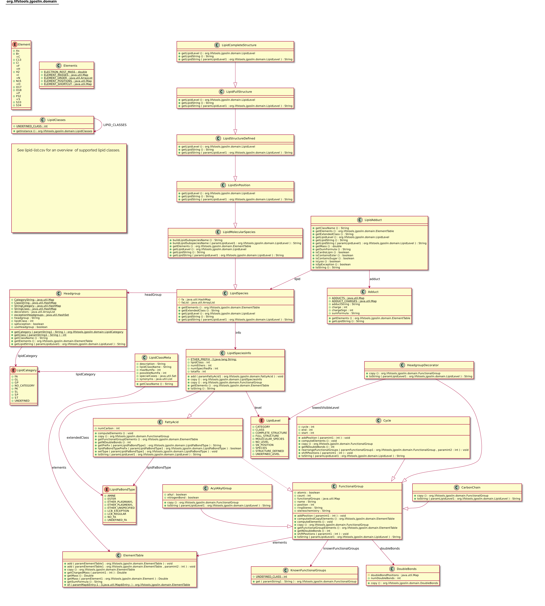

= Goslin Implementation and User Guide
:sectnums:
:toc: left
:doctype: book
//only works on some backends, not HTML
:showcomments:
//use style like Section 1 when referencing within the document.
:xrefstyle: short
:figure-caption: Figure
:pdf-page-size: A4

:gitplant: http://www.plantuml.com/plantuml/proxy?src=https://raw.githubusercontent.com/lifs-tools/goslin/master/docs

//GitHub specific settings
ifdef::env-github[]
:tip-caption: :bulb:
:note-caption: :information_source:
:important-caption: :heavy_exclamation_mark:
:caution-caption: :fire:
:warning-caption: :warning:
endif::[]

Dominik Kopczynski; Nils Hoffmann; Bing Peng; Robert Ahrends

[[introduction]]
== Introduction
This document gives an overview for users and developers who want to use the Goslin Webapplication, REST API, or any of the implementations in C++, R, Python or Java.

== Lipid Shorthand Nomenclature Grammars
Goslin uses ANTLRv4 compatible context-free EBNF grammars. A generic recursive decent parser is used by the different Goslin implementations (see https://en.wikipedia.org/wiki/Context-free_language, https://en.wikipedia.org/wiki/LL_parser, https://www.antlr.org/about.html).

The grammars (*.g4 files) are available from our Goslin GitHub repository at https://github.com/lifs-tools/goslin. 

== Hierarchical Representation of Lipids

The grammars model lipids as hierarchically structured bits of information. 
We do not model the lipid category or main class explicitly, but rather keep them in a global lookup table data structure, derived from the `lipid-list.csv` file in the Goslin GitHub repository. 
This allows us to keep the grammars clutter-free and makes them easier to read. 

The structural classification of lipids follows the shorthand notation recently updated by Liebisch et al. and is compatible to that of LIPID MAPS. The following example shows the hierarchical representation of PE 16:1(6Z)/16:0;5OH[R],8OH;3oxo:

.Structural hierarchy representation of PE(16:1(6Z)/16:0;5OH,8OH;3oxo). LM: LIPID MAPS, HG: Head Group, FA: Fatty Acyl
|===
| **Level** | **Name** | **Description** 
| Category (LM Category) | Glycerophospholipids (GP) | Lipid category
| Class (LM Class) | Glycerophosphoethanolamine (PE) GP02 | Lipid class
| Species (LM Subclass) | Phosphatidylethanolamine (32:1), PE 32:2;O3 | HG, FA summary, two double bond equivalents, three oxidations
| Molecular species | PE 16:1_16:1;O3 | HG, two FAs, SN positions undetermined, two double bond equivalents, three oxidations
| sn-Position | PE 16:1/16:1;O3 | HG, SN positions, here: for FA1 at sn1 and FA2 at sn2, two double bond equivalents, three oxidations
| Structure defined | PE 16:1(6)/16:1;(OH)2;oxo | HG, SN positions, here: for FA1 at sn1 and FA2 at sn2, three oxidations and unspecified stereo configuration (6) on FA1
| Full structure | PE 16:1(6Z)/16:1;5OH,8OH;3oxo | HG, SN positions, here: for FA1 at sn1 and FA2 at sn2, positions for oxidations and stereo configuration (6Z) on FA1
| Complete structure | PE 16:1(6Z)/16:0;5OH[R],8OH;3oxo | HG, SN positions, here: for FA1 at sn1 and FA2 at sn2, positions for oxidations and stereo configuration ([R]) and double bond position and stereo configuration (6Z) on FA1
|===

Please see <<goslinObjectModel>> for an overview of the Goslin domain model which is used to represent the structural hierarchy within the different implementations.

[[webServiceUsers]]
== Web Application and REST API

Interactive Usage
~~~~~~~~~~~~~~~~~

The interactive goslin web application is available
at https://apps.lifs-tools.org/goslin. 

Please check the documentation that is available with the web application on details for usage https://apps.lifs-tools.org/goslin/documentation#user-content-sec:webserviceusers[here].

C++ Implementation
------------------

This is the documentation for the goslin reference implementation for
C++. Please be aware, that the documentation is dedicated to developers
of tools for computational lipidomics who want to use cppgoslin within
their project. If you are interested to run goslin as a user, please
read  <<webServiceUsers>>. The cppgoslin
implementation has been developed with the following objectives:

1.  To ease the handling with lipid names for developers working on mass
spectro-metry-based lipidomics tools.
2.  To offer a tool that unifies all existing dialects of lipid names.

It is an open-source package under the MIT License available via
github footnote:[https://github.com/lifs-tools/cppgoslin]. For a detailed
structure of the implementation, read <<goslinObjectModel>>.

Prerequisites
~~~~~~~~~~~~~

The cppgoslin library needs a GNU g++ compiler version with support for
the C++ 11 standard. It comes with simple makefiles for easy compilation
and installation. You need the following packages:

....
$ g++ (compiler)
$ make
  
....

To install the library globally on your system, simply type:

....
$ [sudo] make install
  
....

Be sure that you have root permissions. Here, the library and headers
are installed into the /usr directory. If you want to change that
location, you have to edit the first line within the _makefile_.

Testing cppgoslin
~~~~~~~~~~~~~~~~~

We set up more than 150 000 single unit and integration tests, to ensure
that cppgoslin is parsing correctly. To run the tests, please type:

....
$ make test
$ make runtests
....

If a test should fail, please contact the
developers.

Using cppgoslin
~~~~~~~~~~~~~~~

The two major functions within cppgoslin are the parsing and printing of
lipid names. A minimalistic example will demonstrate both functions the
easiest way. In the examples folder, you will find the
_lipid_name_parser.cpp_ file. Compile it by typing:

....
$ cd examples
$ make
$ ./lipid_name_parser
....

Here is the minimalistic C++ code:

[source,c++]
----
#include "cppgoslin/cppgoslin.h"
#include <iostream>
int main(){
    LipidParser parser;
    try {
        LipidAdduct* lipid = parser.parse("PA(12:0_14:0)");
        cout << lipid->get_lipid_string() << endl;
        delete lipid;
    }
    catch(LipidException& e){
        // handle the exception
        cout << e.what() << endl;
    }
    return 0;
}
----

To handle unexpected behavior, the parsing command should always be
placed within a try/catch block and the `LipidAdduct` pointer should be
deleted after usage to avoid memory leaks. Be aware when changing the
installation directory, you also have to change the library directory
within the examples _makefile_.

To retrieve a parsed lipid name on a higher hierarchy of lipid level,
simply define the level when requesting the lipid name:

[source,c++]
----
#include "cppgoslin/cppgoslin.h"
#include <iostream>
int main(){
    LipidParser parser;
    try {
        // providing a lipid name on isomeric subspecies level
        LipidAdduct* lipid = parser.parse("PA(12:1(5Z)/14:0)");
        cout << lipid->get_lipid_string(ISOMERIC_SUBSPECIES) << endl;
        cout << lipid->get_lipid_string(STRUCTURAL_SUBSPECIES) << endl;
        cout << lipid->get_lipid_string(MOLECULAR_SUBSPECIES) << endl;
        cout << lipid->get_lipid_string(SPECIES) << endl;
        cout << lipid->get_lipid_string(CLASS) << endl;
        cout << lipid->get_lipid_string(CATEGORY) << endl;
        delete lipid;
    }
    catch(LipidException& e){
        // handle the exception
        cout << e.what() << endl;
    }
    return 0;
}
----

Requesting a lipid name on a lower level than the provided will throw an
exception. This functionality especially enables an easy way for
computing data for histograms on lipid class or category level. +
  +
To increase the parsing performance, one can pick a parser for only one
specific grammar:

[source,c++]
----
GoslinParser goslin_parser;
GoslinFragmentParser goslin_fragment_parser;
LipidMapsParser lipid_maps_parser;
SwissLipidsParser swiss_lipids_parser;
HmdbParser hmdb_parser;
----

Python Implementation
---------------------

This is the documentation for the goslin reference implementation for
Python 3. Please be aware, that the documentation is dedicated to
developers of tools for computational lipidomics who want to insert
pygoslin into their project. If you are interested to run goslin as a
user, please read Section <<webServiceUsers>>. The pygoslin
implementation has been developed with the following objectives:

1.  To ease the handling with lipid names for developers working on mass
spectrometrybased lipidomics tools.
2.  To offer a tool that unifies all existing dialects of lipid names.

It is an open-source package under the MIT License available via
github footnote:[https://github.com/lifs-tools/pygoslin]. For a detailed
structure of the implementation, read <<goslinObjectModel>>.

Prerequisites
~~~~~~~~~~~~~

The pygoslin package uses Python’s package management system _pip_ to
create an isolated and defined build environment. You need Python >=3.5
and the following packages to build the pygoslin package:

....
python3-pip
cython (module for Python 3)
make (optional)
....

  +
To install the package globally in your Python distribution, simply
type:

....
$ [sudo] make install
....

or

....
$ [sudo] python setup.py install
....

Be sure that you have root permissions.

Testing pygoslin
~~~~~~~~~~~~~~~~

We set up more than 150 000 single unit and integration tests, to ensure
that pygoslin is parsing correctly. To run the tests, please type:

....
$ make test
....

or

....
$ python3 -m unittest pygoslin.tests.FattyAcidTest
$ python3 -m unittest pygoslin.tests.ParserTest
$ python3 -m unittest pygoslin.tests.SwissLipidsTest
$ python3 -m unittest pygoslin.tests.GoslinTest
$ python3 -m unittest pygoslin.tests.LipidMapsTest
$ python3 -m unittest pygoslin.tests.HmdbTest
....

Using pygoslin
~~~~~~~~~~~~~~

The two major functions within pygoslin are the parsing and printing of
lipid names. You have several options, to access these functions. This
example will demonstrate both functions the easiest way. Open a Python
shell and type in:

[source,python]
----
from pygoslin.parser.Parser import LipidParser

lipid_parser = LipidParser()  # setup the parser
lipid_name = "PE 16:1-12:0"

try:
    lipid = lipid_parser.parse(lipid_name)  # start parsing
    print(lipid.get_lipid_string())
except Exception as e:
    print(e)         # handle the exception
----

For all unexpected states, an exception is being raised. Be aware, that
this method uses all available grammars in turn until a lipid name can
be parsed successfully by a parser. Currently, five grammars are
available, namely: Goslin, GoslinFragment, LipidMaps, SwissLipids, HMDB.
To use a specific grammar / parser, you can use the following code:

[source,python]
----
# using solely the Goslin parser
from pygoslin.parser.Parser import GoslinParser
goslin_parser = GoslinParser()

lipid_name = "Cer 18:1;2/12:0"
try:
    lipid = goslin_parser.parse(lipid_name)
    print(lipid.get_lipid_string())
except Exception as e:
    print(e)
----

  +

[source,python]
----
# using solely the Goslin Fragment parser
from pygoslin.parser.Parser import GoslinFragmentParser
goslin_fragment_parser = GoslinFragmentParser()

lipid_name = "Cer 18:1;2/12:0"
try:
    lipid = goslin_fragment_parser.parse(lipid_name)
    print(lipid.get_lipid_string())
except Exception as e:
    print(e)
----

  +

[source,python]
----
# using solely the LipidMaps parser
from pygoslin.parser.Parser import LipidMapsParser
lipid_maps_parser = LipidMapsParser()

lipid_name = "Cer(d18:1/12:0)"
try:
    lipid = lipid_maps_parser.parse(lipid_name)
    print(lipid.get_lipid_string())
except Exception as e:
    print(e)
----

  +

[source,python]
----
# using solely the SwissLipids parser
from pygoslin.parser.Parser import SwissLipidsParser
swiss_lipids_parser = SwissLipidsParser()

lipid_name = "Cer(d18:1/12:0)"
try:
    lipid = swiss_lipids_parser.parse(lipid_name)
    print(lipid.get_lipid_string())
except Exception as e:
    print(e)
----

  +

[source,python]
----
# using solely the HMDB parser
from pygoslin.parser.Parser import HmdbParser
hmdb_parser = HmdbParser()

lipid_name = "Cer(d18:1/12:0)"
try:
    lipid = hmdb_parser.parse(lipid_name)
    print(lipid.get_lipid_string())
except Exception as e:
    print(e)
----

To be as generic as possible, no treatment of validation of the fragment
is conducted within the GoslinFragmentParser. +
  +
To retrieve a parsed lipid name on a higher hierarchy of lipid level,
simply define the level when requesting the lipid name:

[source,python]
----
# report on different lipid hierarchies
from pygoslin.parser.Parser import *
from pygoslin.domain.LipidLevel import LipidLevel

parser = LipidParser()
# providing a lipid name on isomeric subspecies level
lipid_name = "PA 18:1(5Z)/12:0"

try:
    lipid = parser.parse(lipid_name)
    print(lipid.get_lipid_string(LipidLevel.ISOMERIC_SUBSPECIES))
    print(lipid.get_lipid_string(LipidLevel.STRUCTURAL_SUBSPECIES))
    print(lipid.get_lipid_string(LipidLevel.MOLECULAR_SUBSPECIES))
    print(lipid.get_lipid_string(LipidLevel.SPECIES))
    print(lipid.get_lipid_string(LipidLevel.CLASS))
    print(lipid.get_lipid_string(LipidLevel.CATEGORY))
except Exception as e:
    print(e)
----

This functionality especially enables an easy way for computing data for
histograms on lipid class or category level. Requesting a lipid name on
a lower level than the provided will raise an exception.

R Implementation
----------------

This project is a parser, validator and normalizer implementation for
shorthand lipid nomenclatures, using the Grammar of Succinct Lipid
Nomenclatures project for the R language ([https://www.r-project.org/]).

Goslin defines multiple grammars for different sources of shorthand lipid nomenclature. This allows to generate parsers based on the defined grammars, which provide immediate feedback whether a processed lipid shorthand notation string is compliant with a particular grammar, or not.

Here, rgoslin 2.0 uses the Goslin grammars and the cppgoslin parser to support the following general tasks:

1. Facilitate the parsing of shorthand lipid names dialects.
2. Provide a structural representation of the shorthand lipid after parsing.
3. Use the structural representation to generate normalized names, following the latest shorthand nomenclature.

rgoslin is an open-source package available via
github footnote:[https://github.com/lifs-tools/rgoslin].

Prerequisites
~~~~~~~~~~~~~

This project uses the R programming language. To be able to use it,
please install R: [https://cloud.r-project.org/] following the
instructions for your particular operating system. rgoslin is based on
native C++ code (via cppgoslin). It therefore requires additional tools
on your system to compile and install it. Please see the Rcpp
FAQ: [https://cran.r-project.org/web/packages/Rcpp/vignettes/Rcpp-FAQ.pdf],
question 1.3 for installation details for your specific operating
system.

Install the ‘devtools‘ package with the following command.

[source,r]
----
if(!require(devtools)) { install.packages("devtools") }
----

Run

[source,r]
----
install_github("lifs-tools/rgoslin")
----

to install from the github repository.

This will install the latest, potentially unstable development version
of the package with all required dependencies into your local R
installation.

If you want to use a proper release version, referenced by a Git tag
(here: v2.0.0) install the package as follows:

[source,r]
----
install_github("lifs-tools/rgoslin", ref="v2.0.0")
----

If you have cloned the code locally, use devtools as follows. Make sure
you set the working directory to where the API code is located. Then
execute

[source,r]
----
library(devtools)
install(".")
----

Testing rgoslin
~~~~~~~~~~~~~~~

rgoslin uses the testthat R package to provide unit tests for the lipid
name parsing methods. The tests are located in the `tests` folder. To
run the tests, execute

[source,r]
----
library(devtools)
test()
----

Using rgoslin
~~~~~~~~~~~~~

To load the package, start an R session and type

[source,r]
----
library(rgoslin)
----

Type the following to see the package vignette / tutorial:

[source,r]
----
vignette('introduction', package = 'rgoslin')
----

In order to use the provided translation functions of rgoslin, you first
need to load the library.

[source,r]
----
library(rgoslin)
----

If you want to check, which grammars are supported, use the following command:
[source,r]
----
listAvailableGrammars()
----

Currently, the following grammars are available: LipidMaps, SwissLipids,
Goslin, Shorthand2020, FattyAcids, HMDB.

To check, whether a given lipid name can be parsed by any of the parsers
supplied by cppgoslin, you can use the `isValidLipidName` method. It
will return `TRUE` if the given name can be parsed by any of the
available parsers and `FALSE` if the name was not parseable.

[source,r]
----
isValidLipidName("PC 32:1")
----

Using `parseLipidName` with a lipid name returns a data frame of
properties of the parsed lipid name as columns.

[source,r]
----
df <- parseLipidName("PC 32:1")
----

If you want to set the grammar to parse against manually, this is also
possible:

[source,r]
----
originalName <- "TG(16:1(5E)/18:0/20:2(3Z,6Z))"
tagDf <- rgoslin::parseLipidNameWithGrammar(originalName, "LipidMaps")
----

If you want to parse multiple lipid names, use the `parseLipidNames`
method with a vector of lipid names. This returns a data frame of
properties of the parsed lipid names with one row per lipid.

[source,r]
----
multipleLipidNamesDf <- parseLipidNames(c("PC 32:1","LPC 34:1","TG(18:1_18:0_16:1)"))
----

Finally, if you want to parse multiple lipid names and want to use one
particular grammar:

[source,r]
----
originalNames <- c("PC 32:1","LPC 34:1","TAG 18:1_18:0_16:1")
multipleLipidNamesWithGrammar <- parseLipidNamesWithGrammar(originalNames, "Goslin")
----

The Goslin parser also support reading of lipid shorthand names with adducts:

[source,r]
----
originalNames <- c("PC 32:1[M+H]1+", "PC 32:1 [M+H]+","PC 32:1")
lipidNamesWithAdduct <- parseLipidNamesWithGrammar(originalNames, "Goslin")
----

This will populate the columns "Adduct" and "AdductCharge" with the respective values. Please note that we recommend to use the adduct and its charge in full IUPAC recommended nomenclature.

Java Implementation
-------------------

This project is a parser, validator and normalizer implementation for
shorthand lipid nomenclatures, based on goslin for the Java programming
language: [https://go.java/].

goslin defines multiple grammars compatible with ANTLRv4 for different
sources of shorthand lipid nomenclature. This allows to generate parsers
based on the defined grammars, which provide immediate feedback whether
a processed lipid shorthand notation string is compliant with a
particular grammar, or not.

Here, jgoslin uses the goslin grammars and the generated parsers to
support the following general tasks:

1.  Facilitate the parsing of shorthand lipid names dialects.
2.  Provide a structural representation of the shorthand lipid after
parsing.
3.  Use the structural representation to generate normalized names.

Furthermore, jgoslin is an open-source package available via
github footnote:[https://github.com/lifs-tools/jgoslin].

Prerequisites
~~~~~~~~~~~~~

This project is based on Java 17. To use it, you need a jre installed on
your system. If you want to use the library in your own Java projects,
you need a jdk installed on your system. Please consult
[https://go.java/] for installation options and
instructions for your operating system.

Installation instructions

Building the project and generating client code from the command-line

In order to build the client code and run the unit tests, execute the
following command from a terminal:

....
./mvnw install
....

or on Windows:

....
mvnw.bat install
....

This compiles and tests the Java library.

Testing jgoslin
~~~~~~~~~~~~~~~

Here, jgoslin comes with a comprehensive collection of unit (JUnit 5),
integration (JUnit 5) tests. You can run all
of them as follows:

....
./mvnw verify
....

Using the command-line interface
~~~~~~~~~~~~~~~~~~~~~~~~~~~~~~~~

The `cli` sub-project provides a cli for parsing of lipid names either
from the command line or from a file with one lipid name per line.

After building the project as mentioned above with `./mvnw install`, the
`cli/target` folder will contain the `jgoslin-cli-<VERSION>-bin.zip`
file. Alternatively, you can download the latest cli zip file from
our repository: https://lifstools.jfrog.io/ui/artifactSearchResults?name=jgoslin-cli&type=artifacts[Search for latest
jgoslin-cli-<VERSION>-bin.zip artefact] and click to download.

In order to run the validator, unzip that file, change into the unzipped
folder and run

....
java -jar jgoslin-cli-<VERSION>.jar
....

to see the available options.

To parse a single lipid name from the command line using all available
parsers, run

....
java -jar jgoslin-cli-<VERSION>.jar -n "Cer(d18:1/20:2)"
....

The output will tell you what is done and will echo a tab-separated table of the
results to the terminal:

[source,bash]
----
Echoing output to stdout.
Normalized Name	Original Name	Grammar	Message	Adduct	Sum Formula	Mass	Lipid Maps Category	Lipid Maps Main Class	Functional Class Abbr	Functional Class Synonyms	Level	Total #C	Total #DB	Total #OH	LCB SN Position	LCB #C	LCB #DB	LCB Bond Type	LCB DB Positions	FA1 SN Position	FA1 #C	FA1 #DB	FA1 Bond Type	FA1 DB Positions
Cer 18:1;O2/20:2	Cer(d18:1/20:2)	LIPIDMAPS			C38H71NO3	589.5434	Sphingolipids [SP]	Ceramides [SP02]	[SP02]	[Cer, Ceramide]	SN_POSITION	38	3	2	0	18	1	LCB_EXCEPTION		2	20	2	ESTER	
----

To parse multiple lipid names from a file via the commmand line, run

....
java -jar jgoslin-cli-<VERSION>.jar -f examples/lipidnames.txt
....

To use a specific grammar, instead of trying all, run

....
java -jar jgoslin-cli-<VERSION>.jar -f examples/lipidnames.txt -g GOSLIN
....

To write output to the tab-separated output file ’goslin-out.tsv’
instead of to the terminal, run

....
java -jar jgoslin-cli-<VERSION>.jar -f examples/lipidnames.txt -g GOSLIN -o
....

If you want to use all available grammars, simply omit the `-g GOSLIN`
argument. Please note that will increase the runtime significantly since all
available parsers will be run against each name until the first one returns successfully.

Using jgoslin
~~~~~~~~~~~~~

To integrate jgoslin in your own projects as a library, please see the
README file at https://github.com/lifs-tools/jgoslin for more details.

The following snippet shows how to parse a shorthand lipid name with the
different parsers:

[source,java]
----
import org.lifstools.jgoslin.domain.*; // contains Domain objects like LipidAdduct, LipidSpecies ...
import org.lifstools.jgoslin.parser.*; // contains the parser implementations
...

String ref = "Cer(d18:1/20:2)";
try {
	// use the SwissLipids parser
	SwissLipidsParser slParser = new SwissLipidsParser();
	// multiple eventhandlers can be used with one parser, e.g. in parallel processing
	SwissLipidsParserEventHandler slHandler = slParser.newEventHandler();
	LipidAdduct sllipid = slParser.parse(ref, slHandler);
	System.out.println(sllipid.getLipidString()); // to print the lipid name at its native level to the console
} catch (LipidException ptve) {
// catch this for any parsing or semantic issues with a lipid
	ptve.printStackTrace();
}

//alternatively, use the other parsers. Don't forget to place try catch blocks around the following lines, as for the SwissLipids parser example
// use the LipidMAPS parser
LipidMapsParser lmParser = new LipidMapsParser();
LipidMapsParserEventHandler lmHandler = lmParser.newEventHandler();
LipidAdduct lmlipid = lmParser.parse(ref, lmHandler);
// use the shorthand notation parser GOSLIN
GoslinParser goslinParser = new GoslinParser();
GoslinParserEventHandler goslinHandler = goslinParser.newEventHandler();
LipidAdduct golipid = goslinParser.parse(ref, goslinHandler);
// use the updated shorthand notation of 2020
ShorthandParser shorthandParser = new ShorthandParser();
ShorthandParserEventHandler shorthandHandler = shorthandParser.newEventHandler();
// calling parse with the optional argument false suppresses any exceptions, if errors are encountered, the returned LipidAdduct will be null
LipidAdduct shlipid = shorthandParser.parse(ref, shorthandHandler, false);

----

To retrieve a parsed lipid name on a higher hierarchy of lipid level,
simply define the level when requesting the lipid name:

[source,java]
----
System.out.println(sllipid.getLipidString(LipidLevel.CATEGORY));
System.out.println(sllipid.getLipidString(LipidLevel.CLASS));
System.out.println(sllipid.getLipidString(LipidLevel.SPECIES));
System.out.println(sllipid.getLipidString(LipidLevel.MOLECULAR_SPECIES));
System.out.println(sllipid.getLipidString(LipidLevel.SN_POSITION));
System.out.println(sllipid.getLipidString(LipidLevel.STRUCTURE_DEFINED));
System.out.println(sllipid.getLipidString(LipidLevel.FULL_STRUCTURE));
System.out.println(sllipid.getLipidString(LipidLevel.COMPLETE_STRUCTURE));
----

This functionality allows easy computation of aggregate statistics of
lipids on lipid class, category or arbitrary levels. Requesting a lipid
name on a lower level than the provided will raise a `org.lifstools.jgoslin.domain.ConstraintViolationException`.

For more examples how the API works, please consult the tests, especially in the parsers module.

For an overview of the domain model used by jgoslin, please see
 <<goslinObjectModel>>.

[[goslinObjectModel]]
Goslin Object Model
-------------------

[[fig-goslinObjectModel]]
.The object model shared by the different implementations.

All goslin implementations are implementing the goslin object model as
illustrated in Figure <<fig-goslin-object-model>>. The classes
`LipidCategory`, `LipidLevel`, `Element`, and `LipidFaBondType` are
predefined enumerations. Here, `LipidClass` is being populated
automatically from a list containing lipid information (name,
description, category, abbreviation, synonyms) for all implementations,
see https://github.com/lifs-tools/goslin/blob/master/lipid-list.csv[lipid-list.csv] for details.
This especially eases the maintenance and ensures that the goslin
implementations have the same data base. The main class unifying all
classes and being provided by the parsers is `LipidAdduct`. It contains
information about the pure lipid, the adduct as well as the fragment (if
defined). The different lipid classes inherit from each other in a
hierarchical fashion as defined by Liebisch et al.. A dictionary with
the class `LipidSpecies` is storing all its associated fatty acyl chains
which are defined within the class `FattyAcid`. For storing the
cummulated information on species level for the carbon length, double
bonds, etc, the class `LipidSpeciesInfo` is utilized. A `FattyAcid` can contain
multiple `FunctionalGroup` objects that can be of type `CarbonChain`, `Cycle`, or `AcylAlkylGroup`.
Known functional groups can be retrieved from `KnownFunctionalGroups`, which is being populated
automatically from a list of known functional groups.

[[supportedLipidClasses]]
Supported Lipid Classes
-----------------------

Please check the most recent version of our https://github.com/lifs-tools/goslin/blob/master/lipid-list.csv[lipid classes table here].
